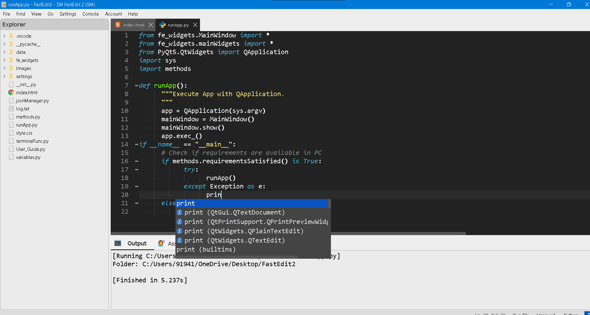

# SM FastEdit 2.0.0
Advanced and refreshed FastEdit is now available! Now it has every tools and features you need for coding.
## Whats New!
<ul>
        <li>Now using QsciScintilla for improving syntax highlighting and line number bar.</li>
        <li>Introduced brace matching feature.</li>
        <li>Improved find text feature and added replace one and replace all feature.</li>
        <li>Added syntax highlighting and folding support for JavaScipt and Python.</li>
        <li>Improved braces auto-completion and folding.</li>
        <li>Now with a new looking default dark theme.</li>
        <li>Now shortcuts and font are editable.</li>
        <li>Now with console and a assistant.</li>
        <li>Added 2 more themes, FastEdit Light and FastEdit Classic.</li>
        <li>Started using json for customizable settings. Added actions in menubar to open <i>.json</i> file/</li>
        <li>New, refreshed file icons.</li>
        <li>Added explorer widget, now you can edit more file in 1 editor area..</li>
        <li>With a smart AI assistant named Assistant</li>
</ul>

## Gallery
<b>Light</b>

<b>Dark</b>

